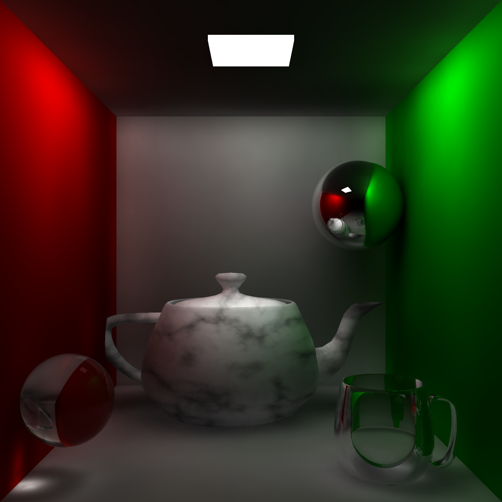

# Monte Carlo Raytracer

    

## What am I looking at?

The image above was generated by firing over 4 million light rays into the scene of objects, and allowing each ray to be reflected up to 16 times depending on the material of the object.

The result is a photorealisitic image that accurately simulates the behaviour of light rays.

### Things to observe

- Colour bleed and soft shadows achieved through Global Illumination
- Regions of focused light as a result of the reflection and refraction of photons by translucent objects
- Procedurally generated 'marble' texture present on the teapot
- Phong shading to give low fidelity mesh objects a perfectly smooth surface

If the image above interests you, then please feel free to read the accompanying [report.pdf](report.pdf) that details how I went about creating it.

### Under the hood

- Bounding spheres for mesh objects to accelerate renders
- Persistent photon maps that allow for the camera to be moved within the scene, without re-emitting hundreds of thousands of photons.
- Fresnel calculations to accurately model the Total Internal Reflection (TIR) 

## Remark

The code quality is by no means exemplar. I wrote this under time constraints for an advanced computer graphics coursework module in my final year at university, and thus there are some questionable design decisions littered throughout. 

That said, I am proud to reveal it received a perfect score of 100/100.

**The raytracer operates without the use of OpenGL!** Not exactly a sane choice, but a requirement of the coursework. This meant that all vector calculations are carried out by hand!
Whilst this restriction increased difficulty tremendously, it also immensely improved my understanding of every intricate detail of modern raytracing graphics technologies.

The practical application of this code is rather limited, but I showcase it simply because it's by far the most __frustratingly enjoyable__ piece of work I've ever completed. 10/10, would code again.

I plan to rewrite this entirely at some point using the skills and mistakes I have made in this program, perhaps in Rust.

## Compilation & Execution 
Compile using:  
`g++ -std=c++11 -o raytrace *.cpp alglib/*.cpp -lm -O3`

Then run with: 
`raytrace <width> <height> <generate_photon_map>`

>eg. `./raytrace 128 128 1` should take less than 30 seconds on modern computer hardware.

## TODO
- [x] clean up and make public
- [ ] proper parallelism
- [ ] better file support / scene setup
- [ ] depth of field?
- [ ] rewrite this all in Rust...
